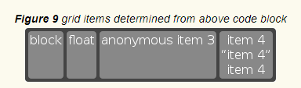
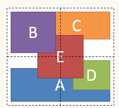
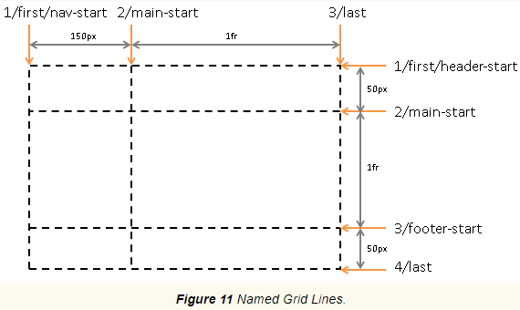

# CSS-Grid-Layout-Module-Level-2

__Это машинный перевод__

Исходник: https://drafts.csswg.org/css-grid-2/

## Абстрактный

Этот модуль CSS определяет двумерную систему разметки на основе сетки, оптимизированную для дизайна пользовательского интерфейса. В модели сетчатой верстки дочерние элементы контейнера сетки могут быть размещены в произвольных слотах предопределенной гибкой или фиксированной по размеру сетки верстки. Уровень 2 расширяет Grid, добавляя возможности "подсеток" для вложенных сеток, которые могут участвовать в определении размеров своих родительских сеток.

CSS - это язык для описания визуализации структурированных документов (таких как HTML и XML) на экране, на бумаге и т. д.

## Статус этого документа

Это публичная копия редакционного проекта. Он предоставляется только для обсуждения и может измениться в любой момент. Его публикация здесь не означает одобрения его содержания W3C. Не ссылайтесь на этот документ иначе, чем как на незавершенную работу.

Пожалуйста, отправляйте отзывы, оформляя проблемы на GitHub (предпочтительно), включая код спецификации "css-grid" в заголовок, например: "[css-grid] ...резюме комментария...". Все проблемы и комментарии архивируются. В качестве альтернативы отзывы можно отправлять в (архивированный) публичный список рассылки www-style@w3.org.

Этот документ регулируется процессуальным документом W3C от 03 ноября 2023 года.

CSSWG приняла решение перевести CSS Grid Level 2 в категорию Candidate Recommendation. Этот переход лишь ожидает редакционной работы по объединению прозы CSS Grid Level 1 в этот документ.

## 1. Введение

Grid Layout - это модель макета для CSS, которая обладает мощными возможностями для управления размерами и позиционированием боксов и их содержимого. В отличие от Flexible Box Layout, которая ориентирована на одну ось, Grid Layout оптимизирована для двумерных макетов: тех, в которых требуется выравнивание содержимого в обоих измерениях.


Кроме того, благодаря возможности явного позиционирования элементов в сетке, Grid Layout позволяет кардинально менять визуальную структуру макета, не требуя соответствующих изменений в разметке. Комбинируя медиазапросы со свойствами CSS, которые управляют расположением контейнера сетки и его дочерних элементов, авторы могут адаптировать свои макеты к изменениям форм-факторов устройств, ориентации и доступного пространства, сохраняя при этом более идеальную семантическую структуру контента в презентациях.

Хотя многие макеты могут быть выражены с помощью Grid или Flexbox, у каждого из них есть свои особенности. Grid обеспечивает двумерное выравнивание, использует нисходящий подход к компоновке, позволяет явно перекрывать элементы и имеет более мощные возможности для разметки. Flexbox фокусируется на распределении пространства внутри оси, использует более простой подход к верстке "снизу вверх", может использовать систему обертывания линий на основе размера содержимого для управления вторичной осью и опирается на иерархию разметки для создания более сложных макетов. Предполагается, что оба варианта станут ценными и взаимодополняющими инструментами для авторов CSS.

Уровень сетки 2 добавляет функцию субсетки: ось с субсеткой - это ось, линии сетки которой совпадают с линиями сетки родительского элемента, и которая получает размеры своих дорожек через эту интеграцию с родительской сеткой.

### 1.1. Предпосылки и мотивация

По мере того как веб-сайты превращались из простых документов в сложные интерактивные приложения, методы верстки документов, например, плавающие элементы, не всегда хорошо подходили для верстки приложений. Используя комбинацию таблиц, JavaScript или тщательные измерения плавающих элементов, авторы находили обходные пути для достижения желаемых макетов. Макеты, адаптированные к доступному пространству, часто были хрупкими и приводили к неинтуитивному поведению, когда пространство становилось ограниченным. В качестве альтернативы авторы многих веб-приложений выбирали фиксированный макет, который не мог использовать изменения в доступном пространстве для визуализации на экране.

Возможности сетчатой верстки решают эти проблемы. Она предоставляет авторам механизм для разделения доступного пространства на столбцы и строки с помощью набора предсказуемых моделей поведения при изменении размера. Затем авторы могут точно расположить и изменить размер элементов приложения в областях сетки, определенных пересечениями этих столбцов и строк. Следующие примеры иллюстрируют адаптивные возможности сетчатой верстки и то, как она позволяет более четко разделять содержимое и стиль.


#### 1.1.1. Адаптация макетов к имеющемуся пространству

Сетчатая разметка может использоваться для интеллектуального изменения размеров элементов на веб-странице. На соседних рисунках представлена игра с пятью основными компонентами в макете: название игры, область статистики, игровое поле, область счета и область управления. По замыслу автора, пространство для игры должно быть разделено таким образом:
- Область статистики всегда отображается сразу под названием игры.
- Игровое поле появляется справа от статистики и названия.
- Верхняя часть заголовка игры и игровое поле всегда должны быть на одном уровне.
- Нижняя часть игрового поля и нижняя часть области статистики выравниваются, если игра достигла минимальной высоты. В остальных случаях игровое поле растягивается, чтобы занять все доступное ему пространство.
- Элементы управления расположены по центру игрового поля.
- Верхняя часть области счета выровнена по верхней части области управления.
- Область счета находится под областью статистики.
- Область счета выровнена по отношению к элементам управления под областью статистики.


Следующий пример расположения сетки показывает, как автор может декларативно достичь всех правил определения размера, размещения и выравнивания.

Пример 1

```css
/**
 * Определите пространство для каждого элемента сетки, объявив сетку * в контейнере сетки.
 */
#grid {
  /**
    * Две колонки:
    * 1. первая имеет размер, соответствующий содержимому,
    * 2. второй занимает оставшееся место
    * (но никогда не бывает меньше минимального размера доски
    * или элементов управления игрой, которые занимают эту колонку [Рисунок 4])
    *
    * Три ряда:
    * 3. первый - по размеру,
    * 4. средний ряд занимает оставшееся пространство
    * (но никогда не бывает меньше минимальной высоты
    * доски или области статистики)
    * 5. последний, размер которого соответствует содержимому.
    */

  display: grid;
  grid-template-columns:
    /* 1 */ auto
    /* 2 */ 1fr;
  grid-template-rows:
    /* 3 */ auto
    /* 4 */ 1fr
    /* 5 */ auto;
}

/* Укажите положение каждого элемента сетки, используя координаты в свойствах
 * свойствах 'grid-row' и 'grid-column' каждого элемента сетки.
 */
#title    { grid-column: 1; grid-row: 1; }
#score    { grid-column: 1; grid-row: 3; }
#stats    { grid-column: 1; grid-row: 2; align-self: start; }
#board    { grid-column: 2; grid-row: 1 / span 2; }
#controls { grid-column: 2; grid-row: 3; justify-self: center; }
```

```html
<div id="grid">
  <div id="title">Game Title</div>
  <div id="score">Score</div>
  <div id="stats">Stats</div>
  <div id="board">Board</div>
  <div id="controls">Controls</div>
</div>
```

> ПРИМЕЧАНИЕ: Существует несколько способов задать структуру сетки, а также расположение и размер элементов сетки, каждый из которых оптимизирован для различных сценариев.


#### 1.1.2. Независимость источника от порядка

Продолжая предыдущий пример, автор также хочет, чтобы игра адаптировалась к различным устройствам. Кроме того, игра должна оптимизировать расположение компонентов при просмотре в портретной или ландшафтной ориентации (рис. 6 и 7). Комбинируя grid layout с media queries, автор может использовать ту же семантическую разметку, но переставлять расположение элементов независимо от их исходного порядка, чтобы добиться желаемого расположения в обеих ориентациях.

В следующем примере используется возможность макета сетки назвать пространство, которое будет занято элементом сетки. Это позволяет автору не переписывать правила для элементов сетки при изменении ее определения.


Пример 2

```css
@media (orientation: portrait) {
  #grid {
    display: grid;

    /* Строки, столбцы и области сетки определяются визуально
     * с помощью свойства grid-template-areas.  Каждая строка - это строка,
     * а каждое слово - область.  Количество слов в строке
     * определяет количество столбцов. Обратите внимание, что количество слов
     * в каждой строке должно быть одинаковым. */
    grid-template-areas: "title stats"
                         "score stats"
                         "board board"
                         "ctrls ctrls";

    /* Способ определения размеров столбцов и строк может быть задан с помощью свойств
     * свойства grid-template-columns и grid-template-rows. */
    grid-template-columns: auto 1fr;
    grid-template-rows: auto auto 1fr auto;
  }
}

@media (orientation: landscape) {
  #grid {
    display: grid;

    /* Снова свойство шаблона определяет одноименные области,
     * но на этот раз расположенные по-другому, чтобы лучше соответствовать
     * альбомной ориентации. */
    grid-template-areas: "title board"
                         "stats board"
                         "score ctrls";

    grid-template-columns: auto 1fr;
    grid-template-rows: auto 1fr auto;
  }
}

/* Свойство grid-area помещает элемент сетки в названную
 * область сетки. */
#title    { grid-area: title }
#score    { grid-area: score }
#stats    { grid-area: stats }
#board    { grid-area: board }
#controls { grid-area: ctrls }
```

```html
<div id="grid">
  <div id="title">Game Title</div>
  <div id="score">Score</div>
  <div id="stats">Stats</div>
  <div id="board">Board</div>
  <div id="controls">Controls</div>
</div>
```

> ПРИМЕЧАНИЕ: Возможности переупорядочивания в макете сетки намеренно влияют только на визуальное отображение, оставляя порядок речи и навигацию на основе исходного порядка. Это позволяет авторам манипулировать визуальным представлением, оставляя исходный порядок нетронутым и оптимизированным для UA, не использующих CSS, и для линейных моделей, таких как речь и последовательная навигация.

Размещение и переупорядочивание элементов сетки не должно заменять правильное упорядочивание источников, так как это может испортить доступность документа.

### 1.2. Определения значений

Данная спецификация следует соглашениям определения свойств CSS из [CSS2], используя синтаксис определения значений из [CSS-VALUES-3]. Типы значений, не определенные в данной спецификации, определены в CSS Values & Units [CSS-VALUES-3]. Комбинация с другими модулями CSS может расширить определения этих типов значений.

В дополнение к специфическим значениям свойств, перечисленным в их определениях, все свойства, определенные в данной спецификации, также принимают в качестве значения свойства общепринятые в CSS ключевые слова. Для удобства чтения они не повторяются в явном виде.

## 2. Обзор

Grid Layout управляет расположением содержимого с помощью сетки: пересекающегося набора горизонтальных и вертикальных линий, которые создают систему координат размера и позиционирования для содержимого контейнера сетки. Возможности Grid Layout

- функции фиксированного, гибкого и основанного на содержимом размера дорожек
- явное размещение элементов с помощью прямых (положительных) и обратных (отрицательных) числовых координат сетки, именованных линий сетки и именованных областей сетки; автоматическое размещение элементов в пустых областях, включая переупорядочивание по порядку
- повторение дорожек с учетом пространства и автоматическое добавление строк или столбцов для размещения дополнительного содержимого
- контроль над выравниванием и расстоянием между элементами с помощью полей, желобов и свойств выравнивания
- возможность перекрытия содержимого и управления слоями с помощью z-index.
Контейнеры сетки могут быть вложены или смешаны с гибкими контейнерами, что необходимо для создания более сложных макетов.

### 2.1 Объявление сетки

Дорожки (строки и столбцы) сетки объявляются и определяются по размеру либо явно через свойства явной сетки, либо неявно при размещении элементов за пределами явной сетки. Свойство сетки и его подсвойства определяют параметры сетки. § 7 Определение сетки

Пример 3

Ниже приведены примеры объявлений сетки:
Ниже объявлена сетка с четырьмя именованными областями: H, A, B и F. Первый столбец имеет размер, соответствующий его содержимому (auto), а второй столбец занимает оставшееся пространство (1fr). Размер строк по умолчанию равен авто (на основе содержимого); последняя строка имеет фиксированный размер 30px.

```css
main  {
  grid: "H H "
        "A B"
        "F F " 30px
  / auto 1fr;
}
```

Ниже объявлена сетка с таким количеством строк размером не менее 5em, которое помещается в высоту контейнера сетки (100vh). У сетки нет явных столбцов; вместо этого столбцы добавляются по мере добавления содержимого, а ширина столбцов выравнивается (1fr). Поскольку содержимое, переливающееся вправо, не будет печататься, альтернативный макет для печати добавляет строки.

```css
main {
  grid: repeat(auto-fill, 5em) / auto-flow 1fr;
  height: 100vh;
}

@media print {
  main {
    grid: auto-flow 1fr / repeat(auto-fill, 5em);
  }
}
```

Ниже объявлена сетка с 5 равномерно расположенными столбцами и тремя строками, причем средняя строка занимает все оставшееся пространство (по крайней мере, достаточное для размещения ее содержимого).

```css
main {
  grid: auto 1fr auto / repeat(5, 1fr);
  min-height: 100vh;
}
```


### 2.2. Размещение предметов

Содержимое контейнера сетки организуется в отдельные элементы сетки (аналогично элементам flex), которые затем назначаются в заранее определенные области сетки. Они могут быть явно размещены с помощью координат через свойства grid-placement или неявно помещены в пустые области с помощью авторазмещения. § 8 Размещение элементов сетки

Пример 4

Ниже приведены примеры объявления размещения в сетке с использованием сокращения grid-area:

```css
grid-area: a; /* Помещение в именованную область сетки "a" */
grid-area: auto; /* Автоматическое размещение в следующей пустой области */
grid-area: 2 / 4; /* Помещается в строку 2, столбец 4 */
grid-area: 1 / 3 / -1; /* Помещается в столбец 3, охватывает все строки */
grid-area: header-start / sidebar-start / footer-end / sidebar-end; /* Размещается с помощью именованных строк */
```

Это эквивалентно следующим объявлениям `grid-row` + `grid-column`:

```css
grid-row: a; grid-column: a;
grid-row: auto; grid-column: auto;
grid-row: 2; grid-column: 4;
grid-row: 1 / -1; grid-column: 3;
grid-row: header-start / footer-end; grid-column: sidebar-start / sidebar-end;
Далее их можно разложить на длинные строки grid-row-start/grid-row-end/grid-column-start/grid-column-end, например

grid-area: a;
/* Эквивалентно grid-row-start: a; grid-column-start: a; grid-row-end: a; grid-column-end: a; */

grid-area: 1 / 3 / -1;
/* Эквивалентно grid-row-start: 1; grid-column-start: 3; grid-row-end: -1; grid-column-end: auto; */
```

### 2.3. Определение размера сетки


После размещения элементов сетки вычисляются размеры дорожек сетки (строк и столбцов) с учетом размеров их содержимого и/или доступного пространства, как указано в определении сетки.

Полученная сетка выравнивается внутри контейнера сетки в соответствии со свойствами align-content и justify-content контейнера сетки. § 11 Выравнивание и интервалы

Пример 5

В следующем примере выравниваются все столбцы, распределяя между ними лишнее пространство, и центрируется сетка в контейнере сетки, если его размер меньше 100vh.

```css
main {
  grid: auto-flow 1fr / repeat(auto-fill, 5em);
  min-height: 100vh;
  justify-content: space-between;
  align-content: safe center;
}
```

В следующем примере выравниваются все столбцы, распределяя между ними лишнее пространство, и центрируется сетка в контейнере сетки, если его размер меньше 100vh.

## 3. Концепции и терминология раскладки сетки

При сетчатой верстке содержимое контейнера сетки размещается путем позиционирования и выравнивания его по сетке. Сетка - это пересекающийся набор горизонтальных и вертикальных линий сетки, который делит пространство контейнера сетки на области сетки, в которые могут быть помещены элементы сетки (представляющие содержимое контейнера сетки). Существует два набора линий сетки: один набор определяет столбцы, идущие вдоль оси блока, и ортогональный набор, определяющий строки вдоль оси inline. [CSS3-WRITING-MODES]


### 3.1. Линии сетки

Линии сетки - это горизонтальные и вертикальные разделительные линии сетки. Линия сетки существует по обе стороны от столбца или строки. На них можно ссылаться по числовому индексу или по имени, указанному автором. Элемент сетки ссылается на линии сетки, чтобы определить свое положение в сетке с помощью свойств grid-placement.

Пример 6

В следующих двух примерах создаются линии сетки в три столбца и четыре строки.
Первый пример демонстрирует, как автор будет позиционировать элемент сетки, используя номера линий сетки:

```css
#grid {
  display: grid;
  grid-template-columns: 150px 1fr;
  grid-template-rows: 50px 1fr 50px;
}

#item1 { grid-column: 2;
         grid-row-start: 1; grid-row-end: 4; }
```


Во втором примере используются явно названные линии сетки:

```css
/* Схема, эквивалентная предыдущему примеру, но с использованием именованных строк */
#grid {
  display: grid;
  grid-template-columns: 150px [item1-start] 1fr [item1-end];
  grid-template-rows: [item1-start] 50px 1fr 50px [item1-end];
}

#item1 {
  grid-column: item1-start / item1-end;
  grid-row: item1-start / item1-end;
}
```

### 3.2. Дорожки и ячейки сетки

Дорожка сетки - это общий термин для столбца или строки сетки. Другими словами, это пространство между двумя соседними линиями сетки. Каждой дорожке сетки назначается функция размера, которая определяет, насколько широким или высоким может быть столбец или строка, и, следовательно, насколько далеко друг от друга находятся ограничивающие их линии сетки. Смежные дорожки сетки могут быть разделены желобами, но в остальном они плотно упакованы.

Ячейка сетки - это пересечение строки и столбца сетки. Это наименьшая единица сетки, на которую можно ссылаться при позиционировании элементов сетки.

Пример 7

В следующем примере есть два столбца и три строки. Первый столбец имеет фиксированный размер 150px. Второй столбец использует гибкий размер, который является функцией нераспределенного пространства в сетке, и поэтому будет меняться при изменении ширины контейнера сетки. Если используемая ширина контейнера сетки равна 200px, то второй столбец будет иметь ширину 50px. Если используемая ширина контейнера сетки равна 100px, то второй столбец будет равен 0px, и любое содержимое, размещенное в столбце, будет переполнять контейнер сетки.


```css
#grid {
  display: grid;
  grid-template-columns: 150px 1fr;  /* две колонны */
  grid-template-rows: 50px 1fr 50px; /* три ряда  */
}
```

### 3.3. Области сетки

Область сетки - это логическое пространство, используемое для размещения одного или нескольких элементов сетки. Область сетки состоит из одной или нескольких смежных ячеек сетки. Она ограничена четырьмя линиями сетки, по одной с каждой стороны области сетки, и участвует в определении размеров дорожек сетки, которые она пересекает. Область сетки может быть названа явно с помощью свойства grid-template-areas контейнера сетки, или на нее можно ссылаться неявно по ограничивающим ее линиям сетки. Элемент сетки назначается на область сетки с помощью свойств grid-placement.

Пример 8

```css
/* используя синтаксис шаблона */
#grid  {
  display: grid;
  grid-template-areas: ". a"
                       "b a"
                       ". a";
  grid-template-columns: 150px 1fr;
  grid-template-rows: 50px 1fr 50px;
  height: 100vh;
}

#item1 { grid-area: a }
#item2 { grid-area: b }
#item3 { grid-area: b }

/* Выровняйте элементы 2 и 3 по разным точкам в области сетки "b".  */
/* По умолчанию элементы сетки растягиваются, чтобы вписаться в свою область сетки */
/* и эти элементы будут располагаться один над другим. */
#item2 { align-self: start; }
#item3 { justify-self: end; align-self: end; }
```

Область сетки элемента сетки образует содержащий блок, в который он помещается. Элементы сетки, помещенные в одну и ту же область сетки, не оказывают прямого влияния на расположение друг друга. Однако косвенно элемент сетки, занимающий дорожку сетки с присущей ему функцией определения размера, может влиять на размер этой дорожки (и, следовательно, на положение ее ограничивающих линий сетки), что, в свою очередь, может влиять на положение или размер другого элемента сетки.


### 3.4. Вложенные и подсеточные элементы

Элемент сетки сам может быть контейнером сетки, задав ему display: grid. В общем случае расположение содержимого этой вложенной сетки не зависит от расположения родительской сетки, в которой она участвует.

Однако в некоторых случаях может потребоваться, чтобы содержимое нескольких элементов сетки было выровнено по отношению друг к другу. Вложенная сетка может отложить определение своих строк и/или столбцов до своего родительского контейнера сетки, превратив его в подсетку. В этом случае элементы сетки вложенной сетки участвуют в изменении размеров родительской сетки, позволяя содержимому обеих сеток выравниваться. См. § 9 "Подсетки".

Подсетка задается ключевым словом subgrid в grid-template-rows или grid-template-columns, и может быть подсеточным по одной из осей или по обеим. Сетка, не имеющая подсеток по осям, является автономной сеткой.

Пример 9

Например, предположим, что у нас есть форма, состоящая из списка входов с метками:

```css
<ul>
  <li><label>Name:</label> <input name=fn>
  <li><label>Address:</label> <input name=address>
  <li><label>Phone:</label> <input name=phone>
</ul>
```

Мы хотим, чтобы метки и вводимые данные были выровнены, а каждый элемент списка был оформлен рамкой. Этого можно добиться с помощью вложенной сетки:

```css
ul {
  display: grid;
  grid: auto-flow / auto 1fr;
}
li {
  grid-column: span 2;
  display: grid;
  grid-template-columns: subgrid;
  border: solid;
}
label {
  grid-column: 1;
}
input {
  grid-column: 2;
}
```

## 4. Упорядочивание и доступность

Сетчатая верстка дает авторам большие возможности по перестройке документа. Однако они не заменяют правильного упорядочивания источника документа. Свойство порядка и расположение сетки не влияют на упорядочивание в невизуальных медиа (например, в речи). Аналогично, визуальная перестановка элементов сетки не влияет на порядок обхода по умолчанию в режимах последовательной навигации (например, циклический переход по ссылкам, см., например, tabindex [HTML]).

Авторы должны использовать свойства order и grid-placement только для визуального, а не логического упорядочивания содержимого. Таблицы стилей, использующие эти свойства для логического упорядочивания, не соответствуют требованиям.

> ПРИМЕЧАНИЕ: Это сделано для того, чтобы невизуальные медиа и UA без CSS, которые обычно представляют контент линейно, могли полагаться на логический порядок источников, в то время как функции размещения и упорядочивания сетки используются для настройки визуального расположения. (Поскольку визуальное восприятие двухмерно и нелинейно, желаемый визуальный порядок не всегда эквивалентен желаемому порядку чтения).

Пример 10

Многие веб-страницы имеют похожую форму разметки: верхний колонтитул, нижний колонтитул, затем область содержимого и одна или две дополнительные колонки в середине. Как правило, желательно, чтобы в исходном коде страницы контент шел первым, до дополнительных колонок. Однако из-за этого многие распространенные дизайны, например, когда дополнительные колонки располагаются слева, а область содержимого - справа, становятся трудновыполнимыми. На протяжении многих лет эта проблема решалась разными способами, часто называясь "макет Святого Грааля", когда есть две дополнительные колонки. Grid Layout делает этот пример тривиальным. Например, возьмем следующий набросок кода страницы и желаемого макета:

```html
<!DOCTYPE html>
<header>...</header>
<main>...</main>
<nav>...</nav>
<aside>...</aside>
<footer>...</footer>
```


Такого расположения можно легко добиться с помощью сетчатой раскладки:

```css
body { display: grid;
       grid: "h h h"
             "a b c"
             "f f f";
       grid-template-columns: auto 1fr 20%; }
main    { grid-area: b; min-width: 12em;     }
nav     { grid-area: a; /* auto min-width */ }
aside   { grid-area: c; min-width: 12em;     }
```

В качестве дополнительного бонуса все колонки по умолчанию будут иметь одинаковую высоту, а основной контент - такую ширину, которая необходима для заполнения экрана. Кроме того, это может быть объединено с медиа-запросами для переключения на полностью вертикальный макет на узких экранах:

```css
@media all and (max-width: 60em) {
  /* Слишком узкая, чтобы выдержать три колонны */
  body { display: block; }
}
```

Чтобы сохранить задуманный автором порядок во всех режимах представления, средства создания, включая WYSIWYG-редакторы, а также веб-средства создания, должны изменять порядок исходного документа и не использовать свойства порядка или размещения сетки для изменения порядка, если только автор явно не указал, что порядок исходного документа (который определяет порядок речи и навигации) должен быть не синхронизирован с визуальным порядком.

Пример 11

Например, инструмент может предлагать как расположение элементов сетки с помощью перетаскивания, так и обработку медиа-запросов для создания альтернативных макетов для каждого диапазона размеров экрана.
Поскольку в большинстве случаев переупорядочивание должно затрагивать все диапазоны экранов, а также навигацию и порядок речи, инструмент будет соответствовать визуальному расположению, полученному в результате перетаскивания, одновременно переупорядочивая слой DOM. Однако в некоторых случаях автору может потребоваться разное визуальное расположение для каждого размера экрана. Инструмент мог бы предложить такую функциональность, используя свойства grid-placement вместе с медиа-запросами, но при этом привязывая расположение экрана наименьшего размера к базовому порядку DOM (так как это, скорее всего, будет логичный линейный порядок представления), а также используя свойства grid-placement для изменения визуального представления в других диапазонах размеров.

Такой инструмент будет соответствовать требованиям, в то время как инструмент, использующий свойства grid-placement только для перестановки сетки с помощью перетаскивания (как бы удобно это ни было реализовано), будет несоответствующим.

## 5. Сетчатые контейнеры

### 5.1. Создание контейнеров сетки: значения отображения сетки и inline-grid

Name:	display
New values:	grid | inline-grid

`grid`
Это значение заставляет элемент генерировать контейнерную коробку сетки, которая находится на уровне блоков при размещении в схеме потока.

`inline-grid`
This value causes an element to generate a grid container box that is inline-level when placed in flow layout.

Контейнер сетки, не являющийся подсеткой, создает независимый контекст форматирования сетки для своего содержимого. Это то же самое, что и создание независимого контекста форматирования блока, за исключением того, что вместо блочной раскладки используется сетчатая: плавающие элементы не вторгаются в сетчатый контейнер, а поля сетчатого контейнера не сворачиваются с полями его содержимого. Содержимое контейнера сетки выстраивается в сетку, а линии сетки образуют границы каждого элемента сетки, содержащего блок.

В отличие от содержимого обычной вложенной сетки, содержимое вложенной сетки участвует в контексте форматирования родительской сетки; таким образом, вложенная сетка не создает независимого контекста форматирования.

Сетчатые контейнеры - это не блочные контейнеры, поэтому некоторые свойства, которые были разработаны в предположении блочной компоновки, не применимы в контексте сетчатой компоновки. В частности:

- `float` и `clear` не влияют на элемент сетки. Однако свойство `float` все же влияет на вычисляемое значение display для дочерних элементов контейнера сетки, так как это происходит до определения элементов сетки.
- `vertical-align` не влияет на элемент сетки.
- псевдоэлементы `::first-line` и `::first-letter` не применяются к контейнерам сетки, а контейнеры сетки не передают первую отформатированную строку или первую букву своим предкам.

Если для элемента задано отображение inline-grid, а сам элемент плавающий или абсолютно позиционированный, то вычисляемое значение отображения - grid. Таким образом, таблица в главе 9.7 CSS 2.1 дополнена дополнительной строкой, в которой inline-grid находится в столбце "Указанное значение", а grid - в столбце "Вычисленное значение".

### 5.2. Определение размеров контейнеров сетки

Определение терминов в этом разделе см. в [CSS-SIZING-3].

Размер контейнера сетки определяется правилами контекста форматирования, в котором он участвует:
- Как блок-уровень в контексте форматирования блока, он имеет тот же размер, что и блок-уровень, устанавливающий контекст форматирования, с автоматическим расчетом размера в строке, как и для незамещенных блоков.
- Как поле уровня inline в контексте форматирования inline, оно имеет размер как атомарное поле уровня inline (например, inline-блок).

В контекстах инлайн и блочного форматирования автоматический размер блока контейнера сетки равен его максимальному размеру содержимого.

Возможно, спецификация блочного форматирования должна определить это, но она еще не написана.

Максимальный размер содержимого (минимальный размер содержимого) контейнера сетки - это сумма размеров дорожек контейнера сетки (включая желоба) по соответствующей оси, когда размер сетки определяется ограничением максимального содержимого (ограничением минимального содержимого).

### 5.3. Переполнение прокручиваемой сетки

Свойство overflow применяется к контейнерам сетки.

Так же, как сетка включается в собственное изменение размера (см. § 5.2 Изменение размера контейнеров сетки), она также включается в прокручиваемую область переполнения контейнера сетки.

> ПРИМЕЧАНИЕ: Обратите внимание на взаимодействие с подкладками, когда контейнер сетки является контейнером прокрутки: определены дополнительные подкладки, которые добавляются к прямоугольнику переполнения с прокруткой по мере необходимости, чтобы обеспечить выравнивание содержимого с прокруткой по принципу "место-контент: конец". См. CSS Overflow 3 § 2.2 Прокручиваемое переполнение

### 5.4. Ограничение больших сеток

Поскольку память ограничена, UA могут ограничить возможный размер неявной сетки до определенного UA предела (который должен вмещать строки в диапазоне [-10000, 10000]), отбрасывая все строки за пределами этого предела. Если элемент сетки размещается за пределами этого предела, его область сетки должна быть ограничена в пределах этой ограниченной сетки.

Чтобы зажать область сетки:
- Если область сетки выходит за пределы ограниченной сетки, ее диапазон зажимается до последней линии ограниченной сетки.
- Если область сетки будет расположена полностью за пределами ограниченной сетки, ее диапазон должен быть усечен до 1, а область перепозиционирована на последнюю дорожку сетки на этой стороне сетки.

Пример 12

Например, если UA поддерживает только сетки с не более чем 1000 дорожками в каждом измерении, то следующие свойства размещения:

```css
.grid-item {
  grid-row: 500 / 1500;
  grid-column: 2000 / 3000;
}
```

В итоге это будет эквивалентно:

```css
.grid-item {
  grid-row: 500 / 1001;
  grid-column: 1000 / 1001;
}
```

## 6. Элементы сетки

Грубо говоря, элементы сетки контейнера сетки - это ячейки, представляющие его содержимое в потоке.

Каждый дочерний элемент контейнера сетки становится элементом сетки, а каждая дочерняя текстовая последовательность оборачивается в анонимный элемент сетки контейнера блока. Однако если текстовая последовательность содержит только белое пространство (т. е. символы, на которые может влиять свойство white-space), она не отображается (как если бы ее текстовые узлы имели display:none).

Пример 13

Примеры элементов сетки:
```html
<div style="display: grid">

  <!-- grid item: block child -->
  <div id="item1">block</div>

  <!-- grid item: floated element; floating is ignored -->
  <div id="item2" style="float: left;">float</div>

  <!-- grid item: anonymous block box around inline content -->
  anonymous item 3

  <!-- grid item: inline child -->
  <span>
    item 4
    <!-- grid items do not split around blocks -->
    <q style="display: block" id=not-an-item>item 4</q>
    item 4
  </span>
</div>
```



> ПРИМЕЧАНИЕ: межэлементное белое пространство исчезает: оно не становится собственным элементом сетки, хотя межэлементный текст заворачивается в анонимный элемент сетки.

> ПРИМЕЧАНИЕ: Поле анонимного элемента не подлежит стилизации, поскольку в нем нет элемента, которому можно назначить правила стиля. Однако его содержимое будет наследовать стили (например, настройки шрифта) от контейнера сетки.

### 6.1. Отображение элементов сетки

Если элемент сетки не является подсеткой, он устанавливает независимый контекст форматирования для своего содержимого. Однако элементы сетки являются ячейками на уровне сетки, а не на уровне блока: они участвуют в контексте форматирования сетки своего контейнера, а не в контексте форматирования блока.

Если вычисленное значение отображения ближайшего элемента-предка (пропуская предков display:contents) - grid или inline-grid, собственное значение отображения элемента блокируется. (Подробнее об этом типе преобразования значений отображения см. в CSS2.1§9.7 [CSS2] и CSS Display 3 § 2.7 "Автоматические преобразования типа блока").

> ПРИМЕЧАНИЕ: Блокировка происходит даже в том случае, если элемент grid или inline-grid не генерирует контейнерный блок grid, например, когда он заменяется или находится в поддереве display: none.

>ПРИМЕЧАНИЕ: Некоторые значения display обычно вызывают создание анонимных боксов вокруг исходного бокса. Если такой бокс является элементом сетки, он сначала блокируется, и поэтому создание анонимных боксов не произойдет. Например, два смежных элемента сетки с display: table-cell станут двумя отдельными элементами сетки display: block, вместо того чтобы быть завернутыми в одну анонимную таблицу.

### 6.2 Размер элементов сетки

Размер элемента сетки задается в пределах содержащего блока, определяемого его областью сетки.

Расчеты элементов сетки для автоматических размеров в заданных размерах зависят от их значений самовыравнивания:

`normal`
Если элемент сетки не имеет предпочтительного соотношения сторон и естественного размера по соответствующей оси (если это заменяемый элемент), размер элемента сетки определяется как для align-self: stretch.

В противном случае размер элемента сетки определяется в соответствии с правилами расчета размера для элементов блочного уровня для соответствующей оси. (См. CSS 2.1 § 10 Детали модели визуального форматирования).

`stretch`
Используйте правила расчета размера в строке для незамещенных блоков (определены в CSS 2.1 § 10.3.3 Блочный уровень, незамещенные элементы в нормальном потоке), т.е. размер, соответствующий растяжению.

> ПРИМЕЧАНИЕ: Это может исказить соотношение сторон элемента с предпочтительным соотношением сторон, если его размер также ограничен по другой оси.

`all other values`
Размер элемента - fit-content.

В следующей таблице приведены сведения об автоматическом изменении размеров элементов сетки:


Summary of automatic sizing behavior of grid items
Alignment	Non-replaced Element Size	Replaced Element Size
normal	Fill grid area	Use natural size
stretch	Fill grid area	Fill grid area
start/center/etc.	fit-content sizing (like floats)	Use natural size

> ПРИМЕЧАНИЕ: Автоматическое значение min-width и min-height влияет на размер дорожки по соответствующей оси аналогично тому, как оно влияет на основной размер гибкого элемента. См. § 6.6 Автоматический минимальный размер элементов сетки.

### 6.3. Переупорядоченные элементы сетки: свойство порядка

Свойство `order` также применяется к элементам сетки. Оно влияет на их автоматическое размещение и порядок рисования.

_Как и в случае с переупорядочиванием гибких элементов, свойство order должно использоваться только в том случае, если визуальный порядок должен быть не синхронизирован с порядком речи и навигации; в противном случае вместо этого следует переупорядочить базовый источник документа. См. CSS Flexbox 1 § 5.4.1 Переупорядочивание и доступность в [CSS-FLEXBOX-1]._


### 6.4. Поля и отступы элементов сетки

Поскольку соседние элементы сетки независимо содержатся в блоке, образованном их областями сетки, поля соседних элементов сетки не сворачиваются.

Процентные поля и отступы для элементов сетки, как и для блок-боксов, определяются относительно линейного размера содержащего их блока, например, проценты слева/справа/сверху/снизу определяются относительно ширины содержащего их блока в горизонтальном режиме записи.

Автоматические поля расширяются, чтобы поглотить дополнительное пространство в соответствующем измерении, и поэтому могут использоваться для выравнивания. См. § 11.2 Выравнивание с помощью автоматических полей

### 6.5. Упорядочивание по оси Z: свойство z-index

Элементы сетки могут перекрываться, если они расположены в пересекающихся областях сетки, или даже если они расположены в непересекающихся областях из-за отрицательных полей или позиционирования. Порядок окраски элементов сетки точно такой же, как и у инлайн-блоков [CSS2], за исключением того, что вместо исходного порядка документа используется измененный порядок документа, а значения z-индекса, отличные от auto, создают контекст суммирования, даже если позиция статична (ведет себя точно так же, как если бы позиция была относительной). Таким образом, свойство z-index можно легко использовать для управления порядком элементов сетки по оси z.

> Примечание: Потомки, расположенные вне элемента сетки, по-прежнему участвуют в любом контексте штабелирования, установленном элементом сетки.

Пример 14

На следующей диаграмме показано несколько перекрывающихся элементов сетки, для управления порядком их укладки используется комбинация неявного порядка источника и явного z-индекса.


_Порядок отрисовки контролируется z-индексом и порядком источника._

```html
<style type="text/css">
#grid {
  display: grid;
  grid-template-columns: 1fr 1fr;
  grid-template-rows: 1fr 1fr
}
#A { grid-column: 1 / span 2; grid-row: 2; align-self: end; }
#B { grid-column: 1; grid-row: 1; z-index: 10; }
#C { grid-column: 2; grid-row: 1; align-self: start; margin-left: -20px; }
#D { grid-column: 2; grid-row: 2; justify-self: end; align-self: start; }
#E { grid-column: 1 / span 2; grid-row: 1 / span 2;
     z-index: 5; justify-self: center; align-self: center; }
</style>

<div id="grid">
  <div id="A">A</div>
  <div id="B">B</div>
  <div id="C">C</div>
  <div id="D">D</div>
  <div id="E">E</div>
</div>
```

### 6.6. Автоматический минимальный размер элементов сетки

> ПРИМЕЧАНИЕ: Большая часть терминологии, используемой в этом разделе (и во всей остальной части спецификации), определена в CSS Intrinsic и Extrinsic Sizing [CSS-SIZING-3].

Чтобы обеспечить более разумный минимальный размер по умолчанию для элементов сетки, используемое значение ее автоматического минимального размера по данной оси - это минимальный размер на основе содержимого, если верно все следующее:
- он не является контейнером прокрутки
- он охватывает хотя бы одну дорожку на этой оси, чья функция минимального размера дорожки - auto
- если он охватывает более одной дорожки на этой оси, ни одна из этих дорожек не является гибкой.

В противном случае автоматический минимальный размер равен нулю, как обычно.

> ПРИМЕЧАНИЕ: Минимальный размер, основанный на содержимом, является типом вклада внутреннего размера, и поэтому к нему применимы положения раздела CSS Sizing 3 § 5.2 Intrinsic Contributions.

Минимальный размер элемента сетки, основанный на содержимом, в данном измерении - это его предложение заданного размера, если оно существует, иначе его предложение переданного размера, если оно существует и элемент заменен, иначе его предложение размера содержимого, см. ниже. Однако если в данном измерении элемент сетки охватывает только дорожки сетки, которые имеют фиксированную функцию максимального размера дорожки, то его предложение заданного размера и предложение размера содержимого в этом измерении (и его вход из этого измерения в предложение переданного размера в противоположном измерении) дополнительно ограничиваются до значения меньше или равного растяжению, вписывающемуся в максимальный размер области сетки в этом измерении, как представлено суммой функций максимального размера дорожек сетки этих дорожек плюс любые промежуточные фиксированные желоба.

Во всех случаях предложение размера дополнительно ограничивается максимальным размером по затронутой оси, если она определена. Если элемент является сжимаемым заменяемым элементом и имеет определенный предпочтительный размер или максимальный размер по соответствующей оси, предложение размера ограничивается этими размерами; для этой цели любые неопределенные проценты в этих размерах обращаются в ноль (и считаются определенными).cc

> ПРИМЕЧАНИЕ: Аргумент fit-content() не зажимает минимальный размер на основе содержимого так же, как функция фиксированного максимального размера дорожки.

Предложение размера содержимого, предложение указанного размера и предложение переданного размера, используемые в этом расчете, учитывают соответствующие свойства минимального/максимального/предпочтительного размера, чтобы минимальный размер, основанный на содержимом, не мешал ограничениям, установленным автором, и определены ниже:

**specified size suggestion**
Если предпочтительный размер элемента по соответствующей оси определен, то указанное предложение размера соответствует этому размеру. В противном случае оно не определено.

**transferred size suggestion**
Если элемент имеет предпочтительное соотношение сторон и его предпочтительный размер по противоположной оси определен, то передаваемое предложение размера - это этот размер (зажатый минимальным и максимальным размерами по противоположной оси, если они определены), преобразованный через соотношение сторон. Если элемент имеет определенный предпочтительный или максимальный размер по соответствующей оси, предложение передаваемого размера ограничивается этими размерами; для этого любые неопределенные проценты в этих размерах сводятся к нулю (и считаются определенными).

**content size suggestion**
Предлагаемый размер содержимого - это минимальный размер содержимого по соответствующей оси, зажатый, если он имеет предпочтительное соотношение сторон, любыми определенными минимальными и максимальными размерами по противоположной оси, преобразованными через соотношение сторон.

Для вычисления собственного размера бокса (например, минимального размера содержимого бокса) минимальный размер, основанный на содержимом, приводит к тому, что размер бокса по этой оси становится неопределенным (даже если, например, его свойство width задает определенный размер). Обратите внимание, это означает, что проценты, вычисленные относительно этого размера, будут вести себя как auto.

Для любых целей, кроме вычисления собственных размеров, минимальный размер на основе содержимого (в отличие от явного минимального размера min-content/etc) не заставляет размер бокса становиться неограниченным. Однако если процентное соотношение было определено для размера бокса до применения этого минимума, оно должно быть заново определено для нового размера после его применения.

> Обратите внимание, что хотя минимальный размер, основанный на содержимом, часто бывает уместен и помогает предотвратить перекрытие или вытекание содержимого за пределы контейнера, в некоторых случаях это не так: в частности, если для основной области содержимого документа используется сетчатая верстка, лучше задать явную минимальную ширину с привязкой к шрифту, например min-width: 12em. Минимальная ширина на основе содержимого может привести к тому, что большая таблица или большое изображение растянет размер всей области содержимого, потенциально в зону переполнения, и тем самым сделает строки текста ненужно длинными и трудночитаемыми.

> Обратите внимание, что при использовании размера на основе содержимого для элемента с большим количеством содержимого механизм верстки должен просмотреть все это содержимое, прежде чем найти его минимальный размер, в то время как если автор задает явный минимум, этого не требуется. (Однако для элементов с небольшим количеством содержимого этот обход тривиален и поэтому не является проблемой производительности).

## 7. Определение сетки

### 7.1. Явная сетка

Три свойства grid-template-rows, grid-template-columns и grid-template-areas вместе определяют явную сетку грид-контейнера, указывая его явные грид-пути. Итоговая сетка может оказаться больше из-за элементов сетки, размещенных за пределами явной сетки; в этом случае будут созданы неявные дорожки, размер которых определяется свойствами grid-auto-rows и grid-auto-columns.

Размер явной сетки определяется большим из числа строк/столбцов, заданных grid-template-areas, и числа строк/столбцов, заданных grid-template-rows/grid-template-columns. Любые строки/столбцы, определенные grid-template-areas, но не определенные grid-template-rows/grid-template-columns, получают свой размер из свойств grid-auto-rows/grid-auto-columns. Если эти свойства не определяют явных путей, то явная сетка все равно содержит по одной линии сетки по каждой оси.

Числовые индексы в свойствах размещения сетки отсчитываются от краев явной сетки. Положительные индексы отсчитываются от начальной стороны (начиная с 1 для самой начальной явной линии), а отрицательные - от конечной стороны (начиная с -1 для самой конечной явной линии).

Свойства grid и grid-template - это сокращения, которые можно использовать для одновременной установки всех трех явных свойств сетки (grid-template-rows, grid-template-columns и grid-template-areas). Свойство grid также сбрасывает свойства, управляющие неявной сеткой, в то время как свойство grid-template оставляет их без изменений.

### 7.2. Явное изменение размеров дорожек: свойства grid-template-rows и grid-template-columns

Name:	grid-template-columns, grid-template-rows
Value:	none | <track-list> | <auto-track-list> | subgrid <line-name-list>?
Initial:	none
Applies to:	grid containers
Inherited:	no
Percentages:	относятся к соответствующему измерению области содержания
Computed value:	ключевое слово none или вычисленный список дорожек
Canonical order:	per grammar
Animation type:	если длины списков совпадают, по типу вычисленного значения для каждого элемента в вычисленном списке треков (см. § 7.2.5 Вычисленное значение списка треков и § 7.2.3.3 Интерполяция/комбинация repeat()); дискретно в противном случае

Эти свойства задают в виде списка дорожек, разделенных пробелами, имена строк и функции изменения размера дорожек сетки. Свойство grid-template-columns задает список дорожек для столбцов сетки, а grid-template-rows - список дорожек для строк сетки.

Значения имеют следующие значения:

**none**
Указывает, что явные дорожки сетки не создаются этим свойством (хотя явные дорожки сетки все равно могут быть созданы с помощью grid-template-areas).

> ПРИМЕЧАНИЕ: При отсутствии явной сетки любые строки/столбцы будут генерироваться неявно, а их размер будет определяться свойствами grid-auto-rows и grid-auto-columns.

**<track-list> | <auto-track-list>**
Задает список дорожек в виде серии функций определения размера дорожек и имен строк. Каждая функция размера дорожки может быть задана как длина, процент от размера контейнера сетки, измерение содержимого, занимающего столбец или строку, или доля свободного пространства в сетке. Ее также можно задать в виде диапазона, используя нотацию minmax(), которая может сочетать в себе любой из ранее упомянутых механизмов для задания отдельных функций минимального и максимального размера дорожки для столбца или строки.

**subgrid <line-name-list>?**
Значение subgrid указывает на то, что сетка будет принимать охватываемую часть родительской сетки по данной оси (оси subgridded). Размеры строк/столбцов сетки не указываются явно, а берутся из определения родительской сетки, и элементы подсетки будут участвовать в вычислении собственных размеров (CSS Grid Layout 1 § 11.5 Resolve Intrinsic Track Sizes) всех дорожек, общих с родительской сеткой. По сути, подсетки предоставляют возможность передавать параметры сетки вниз через вложенные элементы, а информацию о размерах, основанную на содержимом, обратно в родительскую сетку.
Аргумент <line-name-list> позволяет локально именовать линии сетки, общие с родительской сеткой: если задан <line-name-list>, указанные <line-names> присваиваются линиям явной сетки подсеток, по одной на строку, начиная со строки 1. Лишние <имена строк> игнорируются.

Если нет родительской сетки или если контейнер сетки вынужден иным образом создать независимый контекст форматирования (например, из-за сдерживания макета [CSS-CONTAIN-2] или абсолютного позиционирования [CSS-POSITION-3]), используемое значение - это начальное значение none, а контейнер сетки не является подсеткой.

Ось, которая не имеет подсеток, является отдельной осью.

Синтаксис трек-листа следующий:
**<track-list>**          = [ <line-names>? [ <track-size> | <track-repeat> ] ]+ <line-names>?
**<auto-track-list>**     = [ <line-names>? [ <fixed-size> | <fixed-repeat> ] ]* <line-names>? <auto-repeat>
                            [ <line-names>? [ <fixed-size> | <fixed-repeat> ] ]* <line-names>?
**<explicit-track-list>** = [ <line-names>? <track-size> ]+ <line-names>?

**<line-name-list>**      = [ <line-names> | <name-repeat> ]+
**<track-size>**          = <track-breadth> | minmax( <inflexible-breadth> , <track-breadth> ) | fit-content( <length-percentage [0,∞]> )
**<fixed-size>**          = <fixed-breadth> | minmax( <fixed-breadth> , <track-breadth> ) | minmax( <inflexible-breadth> , <fixed-breadth> )
**<track-breadth>**       = <length-percentage [0,∞]> | <flex [0,∞]> | min-content | max-content | auto
**<inflexible-breadth>**  = <length-percentage [0,∞]> | min-content | max-content | auto
**<fixed-breadth>**       = <length-percentage [0,∞]>
**<line-names>**          = '[' <custom-ident>* ']'

Где значения компонентов определяются следующим образом...

#### 7.2.1. Размеры дорожек

**<length-percentage [0,∞]>**
Неотрицательная длина или процент, как определено в CSS3 Values. [CSS-VALUES-3] Значения <percentage> относятся к внутреннему размеру контейнера сетки в столбцах сетки и к внутреннему размеру блока контейнера сетки в строках сетки. Если размер контейнера сетки зависит от размера его дорожек, то <percentage> должен рассматриваться как auto, для вычисления собственных размеров контейнера сетки и последующего разрешения относительно этого результирующего размера контейнера сетки для компоновки сетки и ее элементов.

**<flex [0,∞]>**
Неотрицательная величина с единицей fr, определяющая коэффициент гибкости дорожки. Каждая дорожка размера <flex> занимает часть оставшегося пространства пропорционально своему коэффициенту гибкости. Например, если список дорожек имеет размер 1fr 2fr, то дорожки займут ⅓ и ⅔ оставшегося пространства соответственно. Подробнее см. в § 7.2.4 "Гибкие длины: единица fr".

> ПРИМЕЧАНИЕ: Если сумма коэффициентов гибкости меньше 1, они будут занимать только соответствующую часть оставшегося пространства, а не расширяться, заполняя его целиком.

При появлении вне нотации minmax() подразумевает автоматический минимум (т.е. minmax(auto, <flex>)).

**minmax(min, max)**
Определяет диапазон размеров, больший или равный min и меньший или равный max. Если max меньше min, то max будет перекрыт min (по сути, получается minmax(min, min)). Значение <flex> в качестве максимального задает коэффициент изгиба дорожки; в качестве минимального оно недействительно.

> ПРИМЕЧАНИЕ: Будущий уровень этой спецификации может разрешить минимальные значения <flex>, и алгоритм определения размера дорожки будет обновлен для корректного учета этого.

**auto**
Как максимум: представляет наибольший вклад max-содержания элементов сетки, занимающих дорожку сетки; однако, в отличие от max-содержания, позволяет расширять дорожку с помощью свойств align-content и justify-content. Как минимум: представляет наибольший минимальный размер (заданный min-width/min-height) элементов сетки, занимающих дорожку сетки. (Изначально этот размер часто, но не всегда, равен минимальному размеру min-content - см. § 6.6 Автоматический минимальный размер элементов сетки).

При появлении вне нотации minmax(): эквивалентно minmax(auto, auto), представляя диапазон между минимумом и максимумом, описанным выше. (В самых простых случаях он ведет себя аналогично minmax(min-content, max-content), но с дополнительными возможностями).

**max-content**
Представляет наибольший максимальный вклад содержимого элементов сетки, занимающих дорожку сетки.

**min-content**
Представляет наибольший минимальный вклад содержимого элементов сетки, занимающих дорожку сетки.

**fit-content( <length-percentage> )**
Представляет собой формулу max(minimum, min(limit, max-content)), где minimum представляет собой автоминимум (который часто, но не всегда, равен минимуму min-content), а limit - функцию определения размера трека, переданную в качестве аргумента функции fit-content(). По сути, это вычисляется как меньшее из minmax(auto, max-content) и minmax(auto, limit).

**Пример 15**

Учитывая следующее объявление grid-template-columns:

`grid-template-columns: 100px 1fr max-content minmax(min-content, 1fr);`


Создается пять линий сетки:

1. На начальном краю контейнера сетки.
2. В 100px от начального края контейнера сетки.
3. На расстоянии от предыдущей линии, равном половине свободного пространства (ширина контейнера сетки минус ширина негибких дорожек сетки).
4. Расстояние от предыдущей строки, равное максимальному размеру всех элементов сетки, принадлежащих столбцу между этими двумя строками.
5. Расстояние от предыдущей строки, равное наибольшему минимальному размеру элементов сетки, принадлежащих столбцу между этими двумя строками, но не более половины свободного пространства.

Если негибкие размеры (100px, max-content и min-content) в сумме превышают ширину контейнера сетки, последняя линия сетки будет находиться на расстоянии, равном их сумме, от начального края контейнера сетки (размеры 1fr оба разрешаются в 0). Если сумма меньше ширины контейнера сетки, конечная линия сетки будет находиться точно на конечном краю контейнера сетки. Это верно в общем случае, когда среди размеров дорожек сетки есть хотя бы одно значение <flex>.

**Пример 16**

Дополнительные примеры правильных определений дорожек сетки:

```css
/* examples of valid track definitions */
grid-template-rows: 1fr minmax(min-content, 1fr);
grid-template-rows: 10px repeat(2, 1fr auto minmax(30%, 1fr));
grid-template-rows: calc(4em - 5px);
```

> ПРИМЕЧАНИЕ: Размер сетки не является чисто суммой размеров дорожек, так как row-gap, column-gap и justify-content, align-content могут добавлять дополнительное пространство между дорожками.

#### 7.2.2. Именование линий сетки: синтаксис [<custom-ident>*]

Хотя на линии сетки всегда можно ссылаться по их числовому индексу, имена линий могут облегчить понимание и поддержку свойств размещения сетки. Имена линий могут быть явно назначены с помощью свойств grid-template-rows и grid-template-columns или неявно назначены с помощью именованных областей сетки с помощью свойства grid-template-areas.

Пример 17

Например, следующий код дает осмысленные имена всем линиям в сетке. Обратите внимание, что некоторые линии имеют несколько имен.

```css
#grid {
  display: grid;
  grid-template-columns: [first nav-start] 150px [main-start] 1fr [last];
  grid-template-rows: [first header-start] 50px [main-start] 1fr [footer-start] 50px [last];
}
```



Имя строки не может быть span или auto, т.е. <custom-ident> в продукции <line-names> исключает ключевые слова span и auto.

#### 7.2.3. Повторение строк и столбцов: нотация repeat()

Нотация repeat() представляет собой повторяющийся фрагмент трек-листа, что позволяет записать большое количество столбцов или строк с повторяющимся шаблоном в более компактной форме.

**Пример 18**

В этом примере показаны два эквивалентных способа записи одного и того же определения сетки. Оба объявления создают четыре "основных" столбца, каждый шириной 250px, окруженные 10px "водосточными" столбцами.

```css
grid-template-columns: 10px [col-start] 250px [col-end]
                       10px [col-start] 250px [col-end]
                       10px [col-start] 250px [col-end]
                       10px [col-start] 250px [col-end] 10px;
/* то же самое, что и выше, только писать проще */
grid-template-columns: repeat(4, 10px [col-start] 250px [col-end]) 10px;
```

##### 7.2.3.1. Синтаксис функции repeat()

Общий вид синтаксиса repeat() выглядит примерно так,

`repeat( [ <integer [1,∞]> | auto-fill | auto-fit ] , <track-list> )`

Первый аргумент задает количество повторений. Второй аргумент - это список треков, который повторяется столько-то раз. Однако существуют некоторые ограничения:
- Нотация repeat() не может быть вложенной.
- Автоматические повторы (автозаполнение или автоподгонка) не могут сочетаться с полностью внутренними или гибкими размерами (см. грамматику).

Таким образом, точный синтаксис обозначения repeat() имеет несколько форм:

<track-repeat> = repeat( [ <integer [1,∞]> ] , [ <line-names>? <track-size> ]+ <line-names>? )
<auto-repeat>  = repeat( [ auto-fill | auto-fit ] , [ <line-names>? <fixed-size> ]+ <line-names>? )
<fixed-repeat> = repeat( [ <integer [1,∞]> ] , [ <line-names>? <fixed-size> ]+ <line-names>? )
<name-repeat> = repeat( [ <integer [1,∞]> | auto-fill ], <line-names>+)

- Вариант <track-repeat> может представлять повторение любого <размера дорожки>, но ограничен фиксированным числом повторений.
- Вариант <auto-repeat> может автоматически повторяться, чтобы заполнить пространство, но требует определенных размеров дорожки, чтобы можно было рассчитать количество повторений. Он может появиться в списке дорожек только один раз, но в том же списке дорожек могут быть и <фиксированные повторы>.
- Вариант <name-repeat> предназначен для добавления имен строк в подсеточки. Он может использоваться только с ключевым словом subgrid и не может указывать размеры дорожек, только имена строк.

Если функция repeat(), не являющаяся <name-repeat>, помещает два <line-names> рядом друг с другом, списки имен объединяются. Например, repeat(2, [a] 1fr [b]) эквивалентна [a] 1fr [b a] 1fr [b].

##### 7.2.3.2. Повтор-заполнение: автозаполнение и автоподгонка повторов

На субсеточной оси ключевое слово auto-fill действительно только один раз для <line-name-list>, и повторяется столько раз, чтобы список имен соответствовал заданному диапазону сетки субсеток (возвращаясь к 0, если диапазон уже выполнен).

В противном случае на отдельной оси, когда автозаполнение задано как число повторений, если контейнер сетки имеет определенный размер или максимальный размер по соответствующей оси, то число повторений равно наибольшему возможному положительному целому числу, которое не приводит к переполнению содержимого контейнера сетки (рассматривая каждую дорожку как свою функцию максимального размера дорожки, если она определена, или как свою функцию минимального размера дорожки в противном случае, деля функцию максимального размера дорожки на функцию минимального размера дорожки, если обе определены, и принимая во внимание зазор); если любое количество повторений приведет к переполнению, то 1 повторение. В противном случае, если контейнер сетки имеет определенный минимальный размер по соответствующей оси, количество повторений равно наименьшему возможному положительному целому числу, удовлетворяющему этому минимальному требованию. В противном случае указанный список треков повторяется только один раз.

**Пример 19**

Например, следующий код создаст столько 25-символьных колонок, сколько поместится в ширину окна. Если останется свободное место, оно будет распределено между 25-символьными колонками.

```css
body {
  display: grid;
  grid-template-columns: repeat(auto-fill, minmax(25ch, 1fr));
}
```

Ключевое слово auto-fit ведет себя так же, как auto-fill, за исключением того, что после размещения элементов сетки все пустые повторяющиеся дорожки сворачиваются. Пустая дорожка - это дорожка, на которую не помещено ни одного элемента сетки или которая проходит через нее. (Это может привести к тому, что все дорожки будут свернуты, если они все пустые).

Дорожка свернутой сетки рассматривается как имеющая фиксированную функцию размера дорожки 0px, а желоба по обе стороны от нее - включая любое пространство, выделенное при распределенном выравнивании - сворачиваются.

Для определения количества автоповторяющихся дорожек в отдельной оси UA должен установить размер дорожки на определенное UA значение, чтобы избежать деления на ноль. Предполагается, что это значение должно составлять 1px.

##### 7.2.3.3. Интерполяция/комбинация repeat()

Если две нотации repeat() имеют одинаковый первый аргумент (счетчик повторений) и одинаковое количество треков во втором аргументе (список треков), они объединяются путем объединения каждого компонента их вычисленных списков треков по вычисленному значению (так же, как объединение списка треков верхнего уровня). В противном случае они объединяются дискретно.

#### 7.2.4. Гибкая длина: единица измерения fr

Гибкая длина или <flex> - это размер с единицей измерения fr, которая представляет собой часть оставшегося пространства в контейнере сетки. Дорожки с единицами fr называются гибкими, поскольку они сгибаются в ответ на оставшееся пространство подобно тому, как гибкие элементы с нулевым базовым размером заполняют пространство в гибком контейнере.

Распределение оставшегося пространства происходит после того, как все функции определения размера негибких дорожек достигли своего максимума. Общий размер таких строк или столбцов вычитается из доступного пространства, в результате чего образуется остаток, который затем делится между строками и столбцами гибкого размера пропорционально их коэффициенту гибкости.

Доля каждого столбца или строки в оставшемся пространстве может быть вычислена как <flex> * <оставшееся пространство> / <сумма всех flex-факторов> столбца или строки.

> Значения <flex> между 0fr и 1fr имеют несколько особое поведение: когда сумма коэффициентов flex меньше 1, они будут занимать менее 100% оставшегося пространства.
> 
> Значение <flex> дорожки - это фактически запрос на некоторую долю оставшегося пространства, при этом 1fr означает "100% оставшегося пространства"; если дорожки на этой оси запрашивают больше 100% в сумме, то запросы перебалансируются, чтобы сохранить то же соотношение, но использовать ровно 100%. Однако если дорожки запрашивают меньше, чем полный объем (например, три дорожки по .25fr), то каждая из них получит именно то, что запрашивает (по 25 % оставшегося пространства каждой, а последние 25 % останутся незаполненными). Точные сведения о том, как распределяется оставшееся пространство, см. в § 12.7 "Расширение гибких дорожек".
> Этот паттерн необходим для непрерывного поведения по мере приближения значений fr к нулю (что означает, что дорожки не хотят занимать оставшееся пространство). В противном случае дорожка с коэффициентом 1fr занимала бы все свободное пространство; но так же поступала бы и дорожка с коэффициентом 0,1fr, и дорожка с коэффициентом 0,01fr, и т. д., пока, наконец, значение не стало бы достаточно малым, чтобы переполниться до нуля, и дорожка внезапно не заняла бы все свободное пространство. При таком поведении дорожка постепенно занимает все меньше оставшегося пространства по мере того, как ее коэффициент изгиба уменьшается ниже 1fr, плавно переходя к тому, чтобы не занимать ничего из оставшегося пространства при нулевом значении.
> Если такое поведение "частичного заполнения" не является желаемым, авторам следует придерживаться значений ≥ 1; например, использование 1fr и 2fr обычно лучше, чем использование .33fr и .67fr, так как они с большей вероятностью будут вести себя так, как задумано, если дорожки будут добавляться или удаляться.

Когда доступное пространство бесконечно (это происходит, когда ширина или высота контейнера сетки неограниченна), дорожки сетки с гибкими размерами подбираются по размеру содержимого, сохраняя соответствующие пропорции. Используемый размер каждой дорожки сетки с гибким размером вычисляется путем определения максимального размера содержимого каждой дорожки сетки с гибким размером и деления этого размера на соответствующий коэффициент гибкости для определения "гипотетического размера 1fr". Максимальное из этих значений используется в качестве разрешенной длины 1fr (фракция flex), которая затем умножается на коэффициент flex каждой дорожки сетки для определения ее окончательного размера.

> ПРИМЕЧАНИЕ: Значения <flex> не являются <длинами> (и не совместимы с <длинами>, как некоторые значения <процентов>), поэтому они не могут быть представлены в выражениях calc() или объединены с другими типами единиц измерения.

#### 7.2.5. Вычисленное значение трек-листа

Вычисляемый список путей для оси, не являющейся сеткой, представляет собой список, чередующий наборы имен линий и участки путей, причем первым и последним элементами являются наборы имен линий.

Набор имен линий - это (потенциально пустой) набор идентификаторов, представляющих имена линий.

Секция пути - это либо:
- функциональная нотация minmax(), представляющая размер одной дорожки, с вычислением каждой <длины-процента> (вычисляемый размер дорожки)

- функциональная нотация repeat(), представляющая повторяющуюся секцию списка дорожек, с вычисленным <целым> и <трек-листом>, представленным в виде вычисленного списка дорожек (вычисленная нотация repeat).

Вычисленный список путей для оси подсеток - это ключевое слово subgrid, за которым следует список наборов имен линий и вычисленных нотаций повторения, представляющих имена линий, заданных для этой оси.

#### 7.2.6. Разрешенное значение трек-листа
