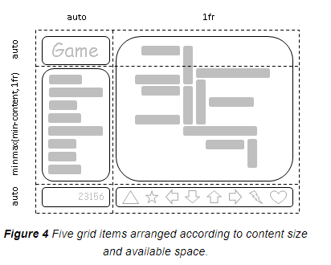

# CSS-Grid-Layout-Module-Level-2
__Это машинный перевод__
Исходник: https://drafts.csswg.org/css-grid-2/

## Абстрактный

Этот модуль CSS определяет двумерную систему разметки на основе сетки, оптимизированную для дизайна пользовательского интерфейса. В модели сетчатой верстки дочерние элементы контейнера сетки могут быть размещены в произвольных слотах предопределенной гибкой или фиксированной по размеру сетки верстки. Уровень 2 расширяет Grid, добавляя возможности "подсеток" для вложенных сеток, которые могут участвовать в определении размеров своих родительских сеток.

CSS - это язык для описания визуализации структурированных документов (таких как HTML и XML) на экране, на бумаге и т. д.

## Статус этого документа

Это публичная копия редакционного проекта. Он предоставляется только для обсуждения и может измениться в любой момент. Его публикация здесь не означает одобрения его содержания W3C. Не ссылайтесь на этот документ иначе, чем как на незавершенную работу.

Пожалуйста, отправляйте отзывы, оформляя проблемы на GitHub (предпочтительно), включая код спецификации "css-grid" в заголовок, например: "[css-grid] ...резюме комментария...". Все проблемы и комментарии архивируются. В качестве альтернативы отзывы можно отправлять в (архивированный) публичный список рассылки www-style@w3.org.

Этот документ регулируется процессуальным документом W3C от 03 ноября 2023 года.

CSSWG приняла решение перевести CSS Grid Level 2 в категорию Candidate Recommendation. Этот переход лишь ожидает редакционной работы по объединению прозы CSS Grid Level 1 в этот документ.

## 1. Введение

Grid Layout - это модель макета для CSS, которая обладает мощными возможностями для управления размерами и позиционированием боксов и их содержимого. В отличие от Flexible Box Layout, которая ориентирована на одну ось, Grid Layout оптимизирована для двумерных макетов: тех, в которых требуется выравнивание содержимого в обоих измерениях.


Кроме того, благодаря возможности явного позиционирования элементов в сетке, Grid Layout позволяет кардинально менять визуальную структуру макета, не требуя соответствующих изменений в разметке. Комбинируя медиазапросы со свойствами CSS, которые управляют расположением контейнера сетки и его дочерних элементов, авторы могут адаптировать свои макеты к изменениям форм-факторов устройств, ориентации и доступного пространства, сохраняя при этом более идеальную семантическую структуру контента в презентациях.

Хотя многие макеты могут быть выражены с помощью Grid или Flexbox, у каждого из них есть свои особенности. Grid обеспечивает двумерное выравнивание, использует нисходящий подход к компоновке, позволяет явно перекрывать элементы и имеет более мощные возможности для разметки. Flexbox фокусируется на распределении пространства внутри оси, использует более простой подход к верстке "снизу вверх", может использовать систему обертывания линий на основе размера содержимого для управления вторичной осью и опирается на иерархию разметки для создания более сложных макетов. Предполагается, что оба варианта станут ценными и взаимодополняющими инструментами для авторов CSS.

Уровень сетки 2 добавляет функцию субсетки: ось с субсеткой - это ось, линии сетки которой совпадают с линиями сетки родительского элемента, и которая получает размеры своих дорожек через эту интеграцию с родительской сеткой.

### 1.1. Предпосылки и мотивация

По мере того как веб-сайты превращались из простых документов в сложные интерактивные приложения, методы верстки документов, например, плавающие элементы, не всегда хорошо подходили для верстки приложений. Используя комбинацию таблиц, JavaScript или тщательные измерения плавающих элементов, авторы находили обходные пути для достижения желаемых макетов. Макеты, адаптированные к доступному пространству, часто были хрупкими и приводили к неинтуитивному поведению, когда пространство становилось ограниченным. В качестве альтернативы авторы многих веб-приложений выбирали фиксированный макет, который не мог использовать изменения в доступном пространстве для визуализации на экране.

Возможности сетчатой верстки решают эти проблемы. Она предоставляет авторам механизм для разделения доступного пространства на столбцы и строки с помощью набора предсказуемых моделей поведения при изменении размера. Затем авторы могут точно расположить и изменить размер элементов приложения в областях сетки, определенных пересечениями этих столбцов и строк. Следующие примеры иллюстрируют адаптивные возможности сетчатой верстки и то, как она позволяет более четко разделять содержимое и стиль.


#### 1.1.1. Адаптация макетов к имеющемуся пространству

Сетчатая разметка может использоваться для интеллектуального изменения размеров элементов на веб-странице. На соседних рисунках представлена игра с пятью основными компонентами в макете: название игры, область статистики, игровое поле, область счета и область управления. По замыслу автора, пространство для игры должно быть разделено таким образом:
- Область статистики всегда отображается сразу под названием игры.
- Игровое поле появляется справа от статистики и названия.
- Верхняя часть заголовка игры и игровое поле всегда должны быть на одном уровне.
- Нижняя часть игрового поля и нижняя часть области статистики выравниваются, если игра достигла минимальной высоты. В остальных случаях игровое поле растягивается, чтобы занять все доступное ему пространство.
- Элементы управления расположены по центру игрового поля.
- Верхняя часть области счета выровнена по верхней части области управления.
- Область счета находится под областью статистики.
- Область счета выровнена по отношению к элементам управления под областью статистики.




Следующий пример расположения сетки показывает, как автор может декларативно достичь всех правил определения размера, размещения и выравнивания.

Пример 1
```css
/**
 * Define the space for each grid item by declaring the grid
 * on the grid container.
 */
#grid {
  /**
   * Two columns:
   *  1. the first sized to content,
   *  2. the second receives the remaining space
   *     (but is never smaller than the minimum size of the board
   *     or the game controls, which occupy this column [Figure 4])
   *
   * Three rows:
   *  3. the first sized to content,
   *  4. the middle row receives the remaining space
   *     (but is never smaller than the minimum height
   *      of the board or stats areas)
   *  5. the last sized to content.
   */
  display: grid;
  grid-template-columns:
    /* 1 */ auto
    /* 2 */ 1fr;
  grid-template-rows:
    /* 3 */ auto
    /* 4 */ 1fr
    /* 5 */ auto;
}

/* Specify the position of each grid item using coordinates on
 * the 'grid-row' and 'grid-column' properties of each grid item.
 */
#title    { grid-column: 1; grid-row: 1; }
#score    { grid-column: 1; grid-row: 3; }
#stats    { grid-column: 1; grid-row: 2; align-self: start; }
#board    { grid-column: 2; grid-row: 1 / span 2; }
#controls { grid-column: 2; grid-row: 3; justify-self: center; }
```

```html
<div id="grid">
  <div id="title">Game Title</div>
  <div id="score">Score</div>
  <div id="stats">Stats</div>
  <div id="board">Board</div>
  <div id="controls">Controls</div>
</div>
```

> ПРИМЕЧАНИЕ: Существует несколько способов задать структуру сетки, а также расположение и размер элементов сетки, каждый из которых оптимизирован для различных сценариев.


#### 1.1.2. Независимость источника от порядка

Продолжая предыдущий пример, автор также хочет, чтобы игра адаптировалась к различным устройствам. Кроме того, игра должна оптимизировать расположение компонентов при просмотре в портретной или ландшафтной ориентации (рис. 6 и 7). Комбинируя grid layout с media queries, автор может использовать ту же семантическую разметку, но переставлять расположение элементов независимо от их исходного порядка, чтобы добиться желаемого расположения в обеих ориентациях.

В следующем примере используется возможность макета сетки назвать пространство, которое будет занято элементом сетки. Это позволяет автору не переписывать правила для элементов сетки при изменении ее определения.


```css
@media (orientation: portrait) {
  #grid {
    display: grid;

    /* The rows, columns and areas of the grid are defined visually
     * using the grid-template-areas property.  Each string is a row,
     * and each word an area.  The number of words in a string
     * determines the number of columns. Note the number of words
     * in each string must be identical. */
    grid-template-areas: "title stats"
                         "score stats"
                         "board board"
                         "ctrls ctrls";

    /* The way to size columns and rows can be assigned with the
     * grid-template-columns and grid-template-rows properties. */
    grid-template-columns: auto 1fr;
    grid-template-rows: auto auto 1fr auto;
  }
}

@media (orientation: landscape) {
  #grid {
    display: grid;

    /* Again the template property defines areas of the same name,
     * but this time positioned differently to better suit a
     * landscape orientation. */
    grid-template-areas: "title board"
                         "stats board"
                         "score ctrls";

    grid-template-columns: auto 1fr;
    grid-template-rows: auto 1fr auto;
  }
}

/* The grid-area property places a grid item into a named
 * area of the grid. */
#title    { grid-area: title }
#score    { grid-area: score }
#stats    { grid-area: stats }
#board    { grid-area: board }
#controls { grid-area: ctrls }
```

```html
<div id="grid">
  <div id="title">Game Title</div>
  <div id="score">Score</div>
  <div id="stats">Stats</div>
  <div id="board">Board</div>
  <div id="controls">Controls</div>
</div>
```

> ПРИМЕЧАНИЕ: Возможности переупорядочивания в макете сетки намеренно влияют только на визуальное отображение, оставляя порядок речи и навигацию на основе исходного порядка. Это позволяет авторам манипулировать визуальным представлением, оставляя исходный порядок нетронутым и оптимизированным для UA, не использующих CSS, и для линейных моделей, таких как речь и последовательная навигация.

Размещение и переупорядочивание элементов сетки не должно заменять правильное упорядочивание источников, так как это может испортить доступность документа.

### 1.2. Определения значений

Данная спецификация следует соглашениям определения свойств CSS из [CSS2], используя синтаксис определения значений из [CSS-VALUES-3]. Типы значений, не определенные в данной спецификации, определены в CSS Values & Units [CSS-VALUES-3]. Комбинация с другими модулями CSS может расширить определения этих типов значений.

В дополнение к специфическим значениям свойств, перечисленным в их определениях, все свойства, определенные в данной спецификации, также принимают в качестве значения свойства общепринятые в CSS ключевые слова. Для удобства чтения они не повторяются в явном виде.

## 2. Обзор