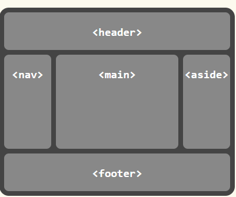

# CSS-Grid-Layout-Module-Level-2

__Это машинный перевод__

Исходник: https://drafts.csswg.org/css-grid-2/

## Абстрактный

Этот модуль CSS определяет двумерную систему разметки на основе сетки, оптимизированную для дизайна пользовательского интерфейса. В модели сетчатой верстки дочерние элементы контейнера сетки могут быть размещены в произвольных слотах предопределенной гибкой или фиксированной по размеру сетки верстки. Уровень 2 расширяет Grid, добавляя возможности "подсеток" для вложенных сеток, которые могут участвовать в определении размеров своих родительских сеток.

CSS - это язык для описания визуализации структурированных документов (таких как HTML и XML) на экране, на бумаге и т. д.

## Статус этого документа

Это публичная копия редакционного проекта. Он предоставляется только для обсуждения и может измениться в любой момент. Его публикация здесь не означает одобрения его содержания W3C. Не ссылайтесь на этот документ иначе, чем как на незавершенную работу.

Пожалуйста, отправляйте отзывы, оформляя проблемы на GitHub (предпочтительно), включая код спецификации "css-grid" в заголовок, например: "[css-grid] ...резюме комментария...". Все проблемы и комментарии архивируются. В качестве альтернативы отзывы можно отправлять в (архивированный) публичный список рассылки www-style@w3.org.

Этот документ регулируется процессуальным документом W3C от 03 ноября 2023 года.

CSSWG приняла решение перевести CSS Grid Level 2 в категорию Candidate Recommendation. Этот переход лишь ожидает редакционной работы по объединению прозы CSS Grid Level 1 в этот документ.

## 1. Введение

Grid Layout - это модель макета для CSS, которая обладает мощными возможностями для управления размерами и позиционированием боксов и их содержимого. В отличие от Flexible Box Layout, которая ориентирована на одну ось, Grid Layout оптимизирована для двумерных макетов: тех, в которых требуется выравнивание содержимого в обоих измерениях.


Кроме того, благодаря возможности явного позиционирования элементов в сетке, Grid Layout позволяет кардинально менять визуальную структуру макета, не требуя соответствующих изменений в разметке. Комбинируя медиазапросы со свойствами CSS, которые управляют расположением контейнера сетки и его дочерних элементов, авторы могут адаптировать свои макеты к изменениям форм-факторов устройств, ориентации и доступного пространства, сохраняя при этом более идеальную семантическую структуру контента в презентациях.

Хотя многие макеты могут быть выражены с помощью Grid или Flexbox, у каждого из них есть свои особенности. Grid обеспечивает двумерное выравнивание, использует нисходящий подход к компоновке, позволяет явно перекрывать элементы и имеет более мощные возможности для разметки. Flexbox фокусируется на распределении пространства внутри оси, использует более простой подход к верстке "снизу вверх", может использовать систему обертывания линий на основе размера содержимого для управления вторичной осью и опирается на иерархию разметки для создания более сложных макетов. Предполагается, что оба варианта станут ценными и взаимодополняющими инструментами для авторов CSS.

Уровень сетки 2 добавляет функцию субсетки: ось с субсеткой - это ось, линии сетки которой совпадают с линиями сетки родительского элемента, и которая получает размеры своих дорожек через эту интеграцию с родительской сеткой.

### 1.1. Предпосылки и мотивация

По мере того как веб-сайты превращались из простых документов в сложные интерактивные приложения, методы верстки документов, например, плавающие элементы, не всегда хорошо подходили для верстки приложений. Используя комбинацию таблиц, JavaScript или тщательные измерения плавающих элементов, авторы находили обходные пути для достижения желаемых макетов. Макеты, адаптированные к доступному пространству, часто были хрупкими и приводили к неинтуитивному поведению, когда пространство становилось ограниченным. В качестве альтернативы авторы многих веб-приложений выбирали фиксированный макет, который не мог использовать изменения в доступном пространстве для визуализации на экране.

Возможности сетчатой верстки решают эти проблемы. Она предоставляет авторам механизм для разделения доступного пространства на столбцы и строки с помощью набора предсказуемых моделей поведения при изменении размера. Затем авторы могут точно расположить и изменить размер элементов приложения в областях сетки, определенных пересечениями этих столбцов и строк. Следующие примеры иллюстрируют адаптивные возможности сетчатой верстки и то, как она позволяет более четко разделять содержимое и стиль.


#### 1.1.1. Адаптация макетов к имеющемуся пространству

Сетчатая разметка может использоваться для интеллектуального изменения размеров элементов на веб-странице. На соседних рисунках представлена игра с пятью основными компонентами в макете: название игры, область статистики, игровое поле, область счета и область управления. По замыслу автора, пространство для игры должно быть разделено таким образом:
- Область статистики всегда отображается сразу под названием игры.
- Игровое поле появляется справа от статистики и названия.
- Верхняя часть заголовка игры и игровое поле всегда должны быть на одном уровне.
- Нижняя часть игрового поля и нижняя часть области статистики выравниваются, если игра достигла минимальной высоты. В остальных случаях игровое поле растягивается, чтобы занять все доступное ему пространство.
- Элементы управления расположены по центру игрового поля.
- Верхняя часть области счета выровнена по верхней части области управления.
- Область счета находится под областью статистики.
- Область счета выровнена по отношению к элементам управления под областью статистики.


Следующий пример расположения сетки показывает, как автор может декларативно достичь всех правил определения размера, размещения и выравнивания.

Пример 1

```css
/**
 * Define the space for each grid item by declaring the grid
 * on the grid container.
 */
#grid {
  /**
   * Two columns:
   *  1. the first sized to content,
   *  2. the second receives the remaining space
   *     (but is never smaller than the minimum size of the board
   *     or the game controls, which occupy this column [Figure 4])
   *
   * Three rows:
   *  3. the first sized to content,
   *  4. the middle row receives the remaining space
   *     (but is never smaller than the minimum height
   *      of the board or stats areas)
   *  5. the last sized to content.
   */
  display: grid;
  grid-template-columns:
    /* 1 */ auto
    /* 2 */ 1fr;
  grid-template-rows:
    /* 3 */ auto
    /* 4 */ 1fr
    /* 5 */ auto;
}

/* Specify the position of each grid item using coordinates on
 * the 'grid-row' and 'grid-column' properties of each grid item.
 */
#title    { grid-column: 1; grid-row: 1; }
#score    { grid-column: 1; grid-row: 3; }
#stats    { grid-column: 1; grid-row: 2; align-self: start; }
#board    { grid-column: 2; grid-row: 1 / span 2; }
#controls { grid-column: 2; grid-row: 3; justify-self: center; }
```

```html
<div id="grid">
  <div id="title">Game Title</div>
  <div id="score">Score</div>
  <div id="stats">Stats</div>
  <div id="board">Board</div>
  <div id="controls">Controls</div>
</div>
```

> ПРИМЕЧАНИЕ: Существует несколько способов задать структуру сетки, а также расположение и размер элементов сетки, каждый из которых оптимизирован для различных сценариев.


#### 1.1.2. Независимость источника от порядка

Продолжая предыдущий пример, автор также хочет, чтобы игра адаптировалась к различным устройствам. Кроме того, игра должна оптимизировать расположение компонентов при просмотре в портретной или ландшафтной ориентации (рис. 6 и 7). Комбинируя grid layout с media queries, автор может использовать ту же семантическую разметку, но переставлять расположение элементов независимо от их исходного порядка, чтобы добиться желаемого расположения в обеих ориентациях.

В следующем примере используется возможность макета сетки назвать пространство, которое будет занято элементом сетки. Это позволяет автору не переписывать правила для элементов сетки при изменении ее определения.


Пример 2

```css
@media (orientation: portrait) {
  #grid {
    display: grid;

    /* The rows, columns and areas of the grid are defined visually
     * using the grid-template-areas property.  Each string is a row,
     * and each word an area.  The number of words in a string
     * determines the number of columns. Note the number of words
     * in each string must be identical. */
    grid-template-areas: "title stats"
                         "score stats"
                         "board board"
                         "ctrls ctrls";

    /* The way to size columns and rows can be assigned with the
     * grid-template-columns and grid-template-rows properties. */
    grid-template-columns: auto 1fr;
    grid-template-rows: auto auto 1fr auto;
  }
}

@media (orientation: landscape) {
  #grid {
    display: grid;

    /* Again the template property defines areas of the same name,
     * but this time positioned differently to better suit a
     * landscape orientation. */
    grid-template-areas: "title board"
                         "stats board"
                         "score ctrls";

    grid-template-columns: auto 1fr;
    grid-template-rows: auto 1fr auto;
  }
}

/* The grid-area property places a grid item into a named
 * area of the grid. */
#title    { grid-area: title }
#score    { grid-area: score }
#stats    { grid-area: stats }
#board    { grid-area: board }
#controls { grid-area: ctrls }
```

```html
<div id="grid">
  <div id="title">Game Title</div>
  <div id="score">Score</div>
  <div id="stats">Stats</div>
  <div id="board">Board</div>
  <div id="controls">Controls</div>
</div>
```

> ПРИМЕЧАНИЕ: Возможности переупорядочивания в макете сетки намеренно влияют только на визуальное отображение, оставляя порядок речи и навигацию на основе исходного порядка. Это позволяет авторам манипулировать визуальным представлением, оставляя исходный порядок нетронутым и оптимизированным для UA, не использующих CSS, и для линейных моделей, таких как речь и последовательная навигация.

Размещение и переупорядочивание элементов сетки не должно заменять правильное упорядочивание источников, так как это может испортить доступность документа.

### 1.2. Определения значений

Данная спецификация следует соглашениям определения свойств CSS из [CSS2], используя синтаксис определения значений из [CSS-VALUES-3]. Типы значений, не определенные в данной спецификации, определены в CSS Values & Units [CSS-VALUES-3]. Комбинация с другими модулями CSS может расширить определения этих типов значений.

В дополнение к специфическим значениям свойств, перечисленным в их определениях, все свойства, определенные в данной спецификации, также принимают в качестве значения свойства общепринятые в CSS ключевые слова. Для удобства чтения они не повторяются в явном виде.

## 2. Обзор


Grid Layout управляет расположением содержимого с помощью сетки: пересекающегося набора горизонтальных и вертикальных линий, которые создают систему координат размера и позиционирования для содержимого контейнера сетки. Возможности Grid Layout

- функции фиксированного, гибкого и основанного на содержимом размера дорожек
- явное размещение элементов с помощью прямых (положительных) и обратных (отрицательных) числовых координат сетки, именованных линий сетки и именованных областей сетки; автоматическое размещение элементов в пустых областях, включая переупорядочивание по порядку
- повторение дорожек с учетом пространства и автоматическое добавление строк или столбцов для размещения дополнительного содержимого
- контроль над выравниванием и расстоянием между элементами с помощью полей, желобов и свойств выравнивания
- возможность перекрытия содержимого и управления слоями с помощью z-index.
Контейнеры сетки могут быть вложены или смешаны с гибкими контейнерами, что необходимо для создания более сложных макетов.

### 2.1 Объявление сетки

Дорожки (строки и столбцы) сетки объявляются и определяются по размеру либо явно через свойства явной сетки, либо неявно при размещении элементов за пределами явной сетки. Свойство сетки и его подсвойства определяют параметры сетки. § 7 Определение сетки

Пример 3

Ниже приведены примеры объявлений сетки:
Ниже объявлена сетка с четырьмя именованными областями: H, A, B и F. Первый столбец имеет размер, соответствующий его содержимому (auto), а второй столбец занимает оставшееся пространство (1fr). Размер строк по умолчанию равен авто (на основе содержимого); последняя строка имеет фиксированный размер 30px.

```css
main  {
  grid: "H H "
        "A B"
        "F F " 30px
  / auto 1fr;
}
```

Ниже объявлена сетка с таким количеством строк размером не менее 5em, которое помещается в высоту контейнера сетки (100vh). У сетки нет явных столбцов; вместо этого столбцы добавляются по мере добавления содержимого, а ширина столбцов выравнивается (1fr). Поскольку содержимое, переливающееся вправо, не будет печататься, альтернативный макет для печати добавляет строки.

```css
main {
  grid: repeat(auto-fill, 5em) / auto-flow 1fr;
  height: 100vh;
}
@media print {
  главный {
    grid: auto-flow 1fr / repeat(auto-fill, 5em);
  }
}
```

Ниже объявлена сетка с 5 равномерно расположенными столбцами и тремя строками, причем средняя строка занимает все оставшееся пространство (по крайней мере, достаточное для размещения ее содержимого).

```css
main {
  grid: auto 1fr auto / repeat(5, 1fr);
  min-height: 100vh;
}
```


### 2.2. Размещение предметов

Содержимое контейнера сетки организуется в отдельные элементы сетки (аналогично элементам flex), которые затем назначаются в заранее определенные области сетки. Они могут быть явно размещены с помощью координат через свойства grid-placement или неявно помещены в пустые области с помощью авторазмещения. § 8 Размещение элементов сетки

Пример 4

Ниже приведены примеры объявления размещения в сетке с использованием сокращения grid-area:

```css
grid-area: a; /* Помещение в именованную область сетки "a" */
grid-area: auto; /* Автоматическое размещение в следующей пустой области */
grid-area: 2 / 4; /* Помещается в строку 2, столбец 4 */
grid-area: 1 / 3 / -1; /* Помещается в столбец 3, охватывает все строки */
grid-area: header-start / sidebar-start / footer-end / sidebar-end; /* Размещается с помощью именованных строк */
```

Это эквивалентно следующим объявлениям `grid-row` + `grid-column`:

```css
grid-row: a; grid-column: a;
grid-row: auto; grid-column: auto;
grid-row: 2; grid-column: 4;
grid-row: 1 / -1; grid-column: 3;
grid-row: header-start / footer-end; grid-column: sidebar-start / sidebar-end;
Далее их можно разложить на длинные строки grid-row-start/grid-row-end/grid-column-start/grid-column-end, например

grid-area: a;
/* Эквивалентно grid-row-start: a; grid-column-start: a; grid-row-end: a; grid-column-end: a; */

grid-area: 1 / 3 / -1;
/* Эквивалентно grid-row-start: 1; grid-column-start: 3; grid-row-end: -1; grid-column-end: auto; */
```

### 2.3. Определение размера сетки


После размещения элементов сетки вычисляются размеры дорожек сетки (строк и столбцов) с учетом размеров их содержимого и/или доступного пространства, как указано в определении сетки.

Полученная сетка выравнивается внутри контейнера сетки в соответствии со свойствами align-content и justify-content контейнера сетки. § 11 Выравнивание и интервалы

Пример 5

В следующем примере выравниваются все столбцы, распределяя между ними лишнее пространство, и центрируется сетка в контейнере сетки, если его размер меньше 100vh.

```css
main {
  grid: auto-flow 1fr / repeat(auto-fill, 5em);
  min-height: 100vh;
  justify-content: space-between;
  align-content: safe center;
}
```

В следующем примере выравниваются все столбцы, распределяя между ними лишнее пространство, и центрируется сетка в контейнере сетки, если его размер меньше 100vh.

## 3. Концепции и терминология раскладки сетки

При сетчатой верстке содержимое контейнера сетки размещается путем позиционирования и выравнивания его по сетке. Сетка - это пересекающийся набор горизонтальных и вертикальных линий сетки, который делит пространство контейнера сетки на области сетки, в которые могут быть помещены элементы сетки (представляющие содержимое контейнера сетки). Существует два набора линий сетки: один набор определяет столбцы, идущие вдоль оси блока, и ортогональный набор, определяющий строки вдоль оси inline. [CSS3-WRITING-MODES]


### 3.1. Линии сетки

Линии сетки - это горизонтальные и вертикальные разделительные линии сетки. Линия сетки существует по обе стороны от столбца или строки. На них можно ссылаться по числовому индексу или по имени, указанному автором. Элемент сетки ссылается на линии сетки, чтобы определить свое положение в сетке с помощью свойств grid-placement.

Пример 6

В следующих двух примерах создаются линии сетки в три столбца и четыре строки.
Первый пример демонстрирует, как автор будет позиционировать элемент сетки, используя номера линий сетки:

```css
#grid {
  display: grid;
  grid-template-columns: 150px 1fr;
  grid-template-rows: 50px 1fr 50px;
}

#item1 { grid-column: 2;
         grid-row-start: 1; grid-row-end: 4; }
```


Во втором примере используются явно названные линии сетки:

```css
/* Схема, эквивалентная предыдущему примеру, но с использованием именованных строк */
#grid {
  display: grid;
  grid-template-columns: 150px [item1-start] 1fr [item1-end];
  grid-template-rows: [item1-start] 50px 1fr 50px [item1-end];
}

#item1 {
  grid-column: item1-start / item1-end;
  grid-row: item1-start / item1-end;
}
```

### 3.2. Дорожки и ячейки сетки

Дорожка сетки - это общий термин для столбца или строки сетки. Другими словами, это пространство между двумя соседними линиями сетки. Каждой дорожке сетки назначается функция размера, которая определяет, насколько широким или высоким может быть столбец или строка, и, следовательно, насколько далеко друг от друга находятся ограничивающие их линии сетки. Смежные дорожки сетки могут быть разделены желобами, но в остальном они плотно упакованы.

Ячейка сетки - это пересечение строки и столбца сетки. Это наименьшая единица сетки, на которую можно ссылаться при позиционировании элементов сетки.

Пример 7

В следующем примере есть два столбца и три строки. Первый столбец имеет фиксированный размер 150px. Второй столбец использует гибкий размер, который является функцией нераспределенного пространства в сетке, и поэтому будет меняться при изменении ширины контейнера сетки. Если используемая ширина контейнера сетки равна 200px, то второй столбец будет иметь ширину 50px. Если используемая ширина контейнера сетки равна 100px, то второй столбец будет равен 0px, и любое содержимое, размещенное в столбце, будет переполнять контейнер сетки.


```css
#grid {
  display: grid;
  grid-template-columns: 150px 1fr;  /* two columns */
  grid-template-rows: 50px 1fr 50px; /* three rows  */
}
```

### 3.3. Области сетки

Область сетки - это логическое пространство, используемое для размещения одного или нескольких элементов сетки. Область сетки состоит из одной или нескольких смежных ячеек сетки. Она ограничена четырьмя линиями сетки, по одной с каждой стороны области сетки, и участвует в определении размеров дорожек сетки, которые она пересекает. Область сетки может быть названа явно с помощью свойства grid-template-areas контейнера сетки, или на нее можно ссылаться неявно по ограничивающим ее линиям сетки. Элемент сетки назначается на область сетки с помощью свойств grid-placement.

Пример 8

```css
/* используя синтаксис шаблона */
#grid  {
  display: grid;
  grid-template-areas: ". a"
                       "b a"
                       ". a";
  grid-template-columns: 150px 1fr;
  grid-template-rows: 50px 1fr 50px;
  height: 100vh;
}

#item1 { grid-area: a }
#item2 { grid-area: b }
#item3 { grid-area: b }

/* Выровняйте элементы 2 и 3 по разным точкам в области сетки "b".  */
/* По умолчанию элементы сетки растягиваются, чтобы вписаться в свою область сетки */
/* и эти элементы будут располагаться один над другим. */
#item2 { align-self: start; }
#item3 { justify-self: end; align-self: end; }
```

Область сетки элемента сетки образует содержащий блок, в который он помещается. Элементы сетки, помещенные в одну и ту же область сетки, не оказывают прямого влияния на расположение друг друга. Однако косвенно элемент сетки, занимающий дорожку сетки с присущей ему функцией определения размера, может влиять на размер этой дорожки (и, следовательно, на положение ее ограничивающих линий сетки), что, в свою очередь, может влиять на положение или размер другого элемента сетки.


### 3.4. Вложенные и подсеточные элементы

Элемент сетки сам может быть контейнером сетки, задав ему display: grid. В общем случае расположение содержимого этой вложенной сетки не зависит от расположения родительской сетки, в которой она участвует.

Однако в некоторых случаях может потребоваться, чтобы содержимое нескольких элементов сетки было выровнено по отношению друг к другу. Вложенная сетка может отложить определение своих строк и/или столбцов до своего родительского контейнера сетки, превратив его в подсетку. В этом случае элементы сетки вложенной сетки участвуют в изменении размеров родительской сетки, позволяя содержимому обеих сеток выравниваться. См. § 9 "Подсетки".

Подсетка задается ключевым словом subgrid в grid-template-rows или grid-template-columns, и может быть подсеточным по одной из осей или по обеим. Сетка, не имеющая подсеток по осям, является автономной сеткой.

Пример 9

Например, предположим, что у нас есть форма, состоящая из списка входов с метками:

```css
<ul>
  <li><label>Name:</label> <input name=fn>
  <li><label>Address:</label> <input name=address>
  <li><label>Phone:</label> <input name=phone>
</ul>
```

Мы хотим, чтобы метки и вводимые данные были выровнены, а каждый элемент списка был оформлен рамкой. Этого можно добиться с помощью вложенной сетки:

```css
ul {
  display: grid;
  grid: auto-flow / auto 1fr;
}
li {
  grid-column: span 2;
  display: grid;
  grid-template-columns: subgrid;
  border: solid;
}
label {
  grid-column: 1;
}
input {
  grid-column: 2;
}
```

## 4. Упорядочивание и доступность

Сетчатая верстка дает авторам большие возможности по перестройке документа. Однако они не заменяют правильного упорядочивания источника документа. Свойство порядка и расположение сетки не влияют на упорядочивание в невизуальных медиа (например, в речи). Аналогично, визуальная перестановка элементов сетки не влияет на порядок обхода по умолчанию в режимах последовательной навигации (например, циклический переход по ссылкам, см., например, tabindex [HTML]).

Авторы должны использовать свойства order и grid-placement только для визуального, а не логического упорядочивания содержимого. Таблицы стилей, использующие эти свойства для логического упорядочивания, не соответствуют требованиям.

> ПРИМЕЧАНИЕ: Это сделано для того, чтобы невизуальные медиа и UA без CSS, которые обычно представляют контент линейно, могли полагаться на логический порядок источников, в то время как функции размещения и упорядочивания сетки используются для настройки визуального расположения. (Поскольку визуальное восприятие двухмерно и нелинейно, желаемый визуальный порядок не всегда эквивалентен желаемому порядку чтения).

Пример 10

Многие веб-страницы имеют похожую форму разметки: верхний колонтитул, нижний колонтитул, затем область содержимого и одна или две дополнительные колонки в середине. Как правило, желательно, чтобы в исходном коде страницы контент шел первым, до дополнительных колонок. Однако из-за этого многие распространенные дизайны, например, когда дополнительные колонки располагаются слева, а область содержимого - справа, становятся трудновыполнимыми. На протяжении многих лет эта проблема решалась разными способами, часто называясь "макет Святого Грааля", когда есть две дополнительные колонки. Grid Layout делает этот пример тривиальным. Например, возьмем следующий набросок кода страницы и желаемого макета:

```html
<!DOCTYPE html>
<header>...</header>
<main>...</main>
<nav>...</nav>
<aside>...</aside>
<footer>...</footer>
```



Такого расположения можно легко добиться с помощью сетчатой раскладки:

```css
body { display: grid;
       grid: "h h h"
             "a b c"
             "f f f";
       grid-template-columns: auto 1fr 20%; }
main    { grid-area: b; min-width: 12em;     }
nav     { grid-area: a; /* auto min-width */ }
aside   { grid-area: c; min-width: 12em;     }
```

В качестве дополнительного бонуса все колонки по умолчанию будут иметь одинаковую высоту, а основной контент - такую ширину, которая необходима для заполнения экрана. Кроме того, это может быть объединено с медиа-запросами для переключения на полностью вертикальный макет на узких экранах:

```css
@media all and (max-width: 60em) {
  /* Too narrow to support three columns */
  body { display: block; }
}
```

Чтобы сохранить задуманный автором порядок во всех режимах представления, средства создания, включая WYSIWYG-редакторы, а также веб-средства создания, должны изменять порядок исходного документа и не использовать свойства порядка или размещения сетки для изменения порядка, если только автор явно не указал, что порядок исходного документа (который определяет порядок речи и навигации) должен быть не синхронизирован с визуальным порядком.

Пример 11

Например, инструмент может предлагать как расположение элементов сетки с помощью перетаскивания, так и обработку медиа-запросов для создания альтернативных макетов для каждого диапазона размеров экрана.
Поскольку в большинстве случаев переупорядочивание должно затрагивать все диапазоны экранов, а также навигацию и порядок речи, инструмент будет соответствовать визуальному расположению, полученному в результате перетаскивания, одновременно переупорядочивая слой DOM. Однако в некоторых случаях автору может потребоваться разное визуальное расположение для каждого размера экрана. Инструмент мог бы предложить такую функциональность, используя свойства grid-placement вместе с медиа-запросами, но при этом привязывая расположение экрана наименьшего размера к базовому порядку DOM (так как это, скорее всего, будет логичный линейный порядок представления), а также используя свойства grid-placement для изменения визуального представления в других диапазонах размеров.

Такой инструмент будет соответствовать требованиям, в то время как инструмент, использующий свойства grid-placement только для перестановки сетки с помощью перетаскивания (как бы удобно это ни было реализовано), будет несоответствующим.
